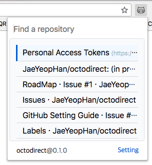
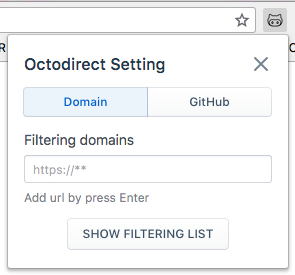
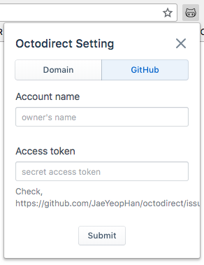

<div align="center">
    
</div>

# Octodirect [](https://chrome.google.com/webstore/detail/octodirect/fmhgcellhhleloebmhbmdncogdddkkag?hl=ko) [](https://chrome.google.com/webstore/detail/octodirect/fmhgcellhhleloebmhbmdncogdddkkag?hl=ko)

[](https://travis-ci.org/JaeYeopHan/octodirect)
[](https://coveralls.io/github/JaeYeopHan/octodirect?branch=master)
[](https://github.com/styled-components/styled-components)
[](https://github.com/prettier/prettier)
[](https://github.com/semantic-release/semantic-release)

[](https://opensource.org/licenses/MIT)

This is Chrome extension.

### Directly, move your GitHub repository which...

- ⚒️ you created.
- 🏠 you visited.
- ⭐ you starred.

> If your 'input' does not exist in both lists, it will automatically search google with `github:` prefix just type `enter`!.

</br>

## Usage

### [Chrome Web Store Download](https://chrome.google.com/webstore/detail/octodirect/fmhgcellhhleloebmhbmdncogdddkkag?hl=ko)

> `NOTE!` Current version is beta.

### `cmd` + `shift` + `k`

<div align="center">

| Main                                                           | Domain Setting                                                 | GitHub Setting                                                 |
| :------------------------------------------------------------: | :------------------------------------------------------------: | :------------------------------------------------------------: |
|  |  |  |

</div>

> `INFO: ` You can change hotkey in [chrome://extensions/shortcuts](chrome://extensions/shortcuts)

</br>

## Development Installation

```sh
$ git clone https://github.com/JaeYeopHan/octodirect.git
$ cd octodirect
$ npm install
$ npm start
# npm test
```

</br>

## LICENSE

[MIT](https://github.com/JaeYeopHan/octodirect/blob/master/LICENSE)

<p align="center">✌️</p>
<p align="center">
<sub><sup>A little project by <a href="https://jbee-resume.now.sh/">@Jbee</a></sup></sub>
</p>
